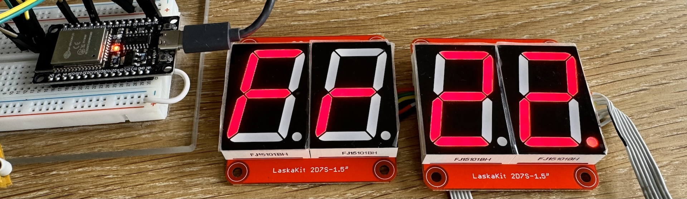
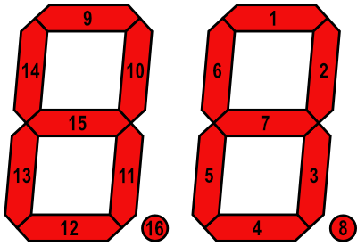

# MicroPython TCL59116 
Micropython library for dual 7-segment LED (with dots) display module using TLC59116 driver



## Examples of use
### Set brightness and display text
```python
import tlc59116
# ESP32 pin assignment and display I2C address setting
disp = tlc59116.TLC59116(sda=21, scl=22, i2c_addr=0x60)
# Set default brightness for all segments
# Possible values are 0 - 255 (0x00 - 0xFF)
disp.brightness = 200
# Switch on all segments on default brightness
disp.led_write('8.8.')
```
### Switch on selected segment
```python
import tlc59116
disp = tlc59116.TLC59116(sda=21, scl=22, i2c_addr=0x60)
# Switch on third segment on brightness 200
disp.set_segment(1, 200)
```

### Clear display
```python
import tlc59116
disp = tlc59116.TLC59116(sda=21, scl=22, i2c_addr=0x60)
# Switch off all segments
disp.led_empty()
```
### Test display
```python
import tlc59116
disp = tlc59116.TLC59116(sda=21, scl=22, i2c_addr=0x60)
# Switch on all segments on max brightness
disp.led_test()
```


